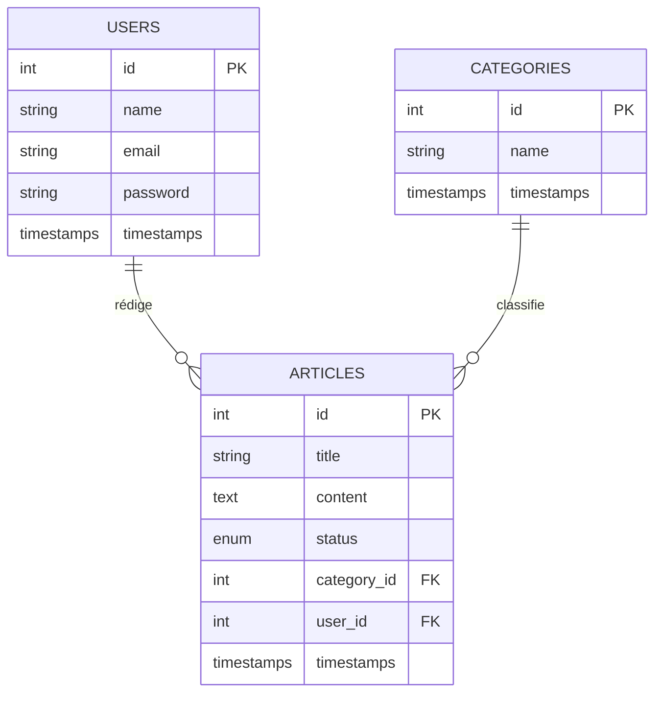
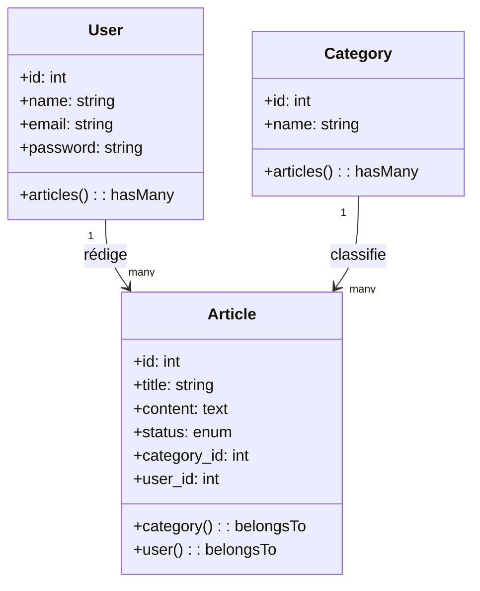
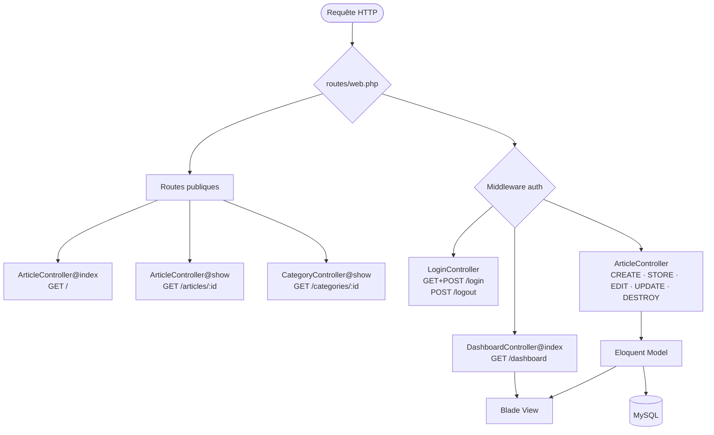

# 📝 BlogPersonal — Laravel Blog Application

Application web de blog personnel développée avec Laravel, déployée via Docker. Ce projet implémente une architecture MVC robuste (Controllers, Eloquent Models, Blade Views), un système d'authentification custom, et un CRUD complet des articles avec gestion des statuts draft/published.

---

## 🚀 Fonctionnalités Clés

- **Blog Public** : Liste des articles publiés, lecture d'un article complet, filtrage par catégorie.
- **Authentification** : Connexion / déconnexion sécurisée avec middleware `auth`.
- **Gestion des Articles** : CRUD complet (créer, modifier, supprimer, changer le statut draft/published).
- **Dashboard Blogger** : Vue centralisée de tous ses articles (draft + published).
- **Infrastructure Docker** : PHP 8.2-fpm, Nginx, MySQL 8.0, phpMyAdmin — un seul `docker-compose up`.

---

## 🏗️ Architecture & Conception

### 📊 Schéma Entité-Relation



### 📋 Tables de la Base de Données

1. **USERS** (**id**, name, email, password, timestamps)
2. **CATEGORIES** (**id**, name, timestamps)
3. **ARTICLES** (**id**, title, content, status `draft|published`, category_id, user_id, timestamps)

### 🗺️ Diagramme de Classes



### 🔄 Routing Flow


---

## 🗄️ Structure de la Base de Données

| Table | Description |
|-------|-------------|
| `users` | Comptes bloggers (1 compte via seeder). |
| `categories` | Catégories d'articles (Laravel, PHP, DevOps, Tips). |
| `articles` | Articles du blog avec statut `draft` ou `published`. |

---

## 📂 Structure du Projet
 
```bash
BlogPersonal/
├── docker-compose.yml                  # Services : app, webserver, db, phpmyadmin
├── Dockerfile                          # PHP 8.2-fpm + extensions Laravel
├── taskboard.md                        # Suivi Scrum du projet
├── docker/nginx/conf.d/app.conf        # Config Nginx → /var/www/public
├── app/Http/Controllers/
│   ├── ArticleController.php           # CRUD articles (resource)
│   ├── CategoryController.php          # Filtre par catégorie
│   ├── DashboardController.php         # Dashboard blogger
│   └── Auth/LoginController.php        # Login / Logout
├── app/Models/
│   ├── Article.php                     # belongsTo Category & User
│   ├── Category.php                    # hasMany Articles
│   └── User.php                        # hasMany Articles
├── database/migrations/                # Toutes les tables via migrations
├── database/seeders/                   # Category · User · Article Seeders
├── resources/views/
│   ├── layouts/app.blade.php           # Layout principal (@auth / @guest)
│   ├── articles/                       # index · show · create · edit
│   ├── dashboard/index.blade.php       # Tableau de bord blogger
│   └── auth/login.blade.php            # Formulaire de connexion
├── routes/web.php                      # Toutes les routes nommées
└── README.md
```
 
---

## 🛠️ Installation & Setup

1. **Clone le repo** :
   ```bash
   git clone https://github.com/<votre-pseudo>/BlogPersonal.git
   cd BlogPersonal
   ```

2. **Copier le fichier d'environnement** :
   ```bash
   cp src/.env.example src/.env
   ```

3. **Lancer Docker** :
   ```bash
   docker-compose up -d --build
   ```

4. **Initialiser la base de données** :
   ```bash
   docker-compose exec app php artisan migrate:fresh --seed
   ```

5. **Accéder à l'application** :
   - Blog public : [http://127.0.0.1:8080](http://127.0.0.1:8080)
   - phpMyAdmin : [http://127.0.0.1:8081/](http://127.0.0.1:8081/)

---

## 🔑 Identifiants du Compte Blogger

| Champ | Valeur |
|-------|--------|
| Email | `blogger@blog.com` |
| Mot de passe | `password` |

---

## 🗺️ Table des Routes

| Méthode | URI | Nom | Controller | Auth |
|---------|-----|-----|------------|:----:|
| GET | `/` | `articles.index` | `ArticleController@index` | |
| GET | `/articles/{article}` | `articles.show` | `ArticleController@show` | |
| GET | `/categories/{category}` | `categories.show` | `CategoryController@show` | |
| GET | `/login` | `login` | `LoginController@showLoginForm` | |
| POST | `/login` | — | `LoginController@login` | |
| POST | `/logout` | `logout` | `LoginController@logout` | |
| GET | `/dashboard` | `dashboard.index` | `DashboardController@index` | ✅ |
| GET | `/articles/create` | `articles.create` | `ArticleController@create` | ✅ |
| POST | `/articles` | `articles.store` | `ArticleController@store` | ✅ |
| GET | `/articles/{article}/edit` | `articles.edit` | `ArticleController@edit` | ✅ |
| PUT | `/articles/{article}` | `articles.update` | `ArticleController@update` | ✅ |
| DELETE | `/articles/{article}` | `articles.destroy` | `ArticleController@destroy` | ✅ |

> Vérifier toutes les routes avec : `docker-compose exec app php artisan route:list`

---

## 🌱 Données Seed

| Entité | Données |
|--------|---------|
| Catégories | Laravel · PHP · DevOps · Tips |
| Blogger | 1 compte (voir identifiants ci-dessus) |
| Articles | 6 articles (mix draft / published) |

---

## 🧪 Vérifications Qualité

- **Validation** : `$request->validate()` sur tous les formulaires (login, create, edit).
- **Sécurité CSRF** : `@csrf` présent sur tous les formulaires.
- **Protection routes** : Accès à `/articles/create` sans connexion → redirect `/login`.
- **Mass assignment** : `$fillable` défini dans chaque Model.
- **Drafts** : Les articles en `draft` n'apparaissent pas sur le blog public.

---

## 📄 Licence

Distribué sous licence Unlicenced.